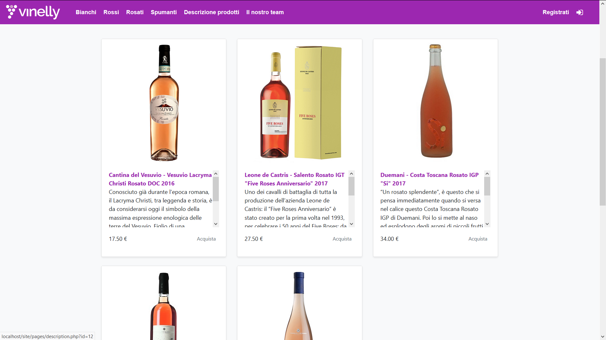

# vinelly


Italian wine e-commerce realized using just `HTML`, `CSS` an `JS`

## Get Started

In order to run the e-commerce, run the devcontainer and type:

```sh
docker-compose up
php -S 127.0.0.1:8000
```

then go to [127.0.0.1:8000](http://127.0.0.1:8000) to visit the e-commerce and to [127.0.0.1:8000/site/pages/panel/](http://127.0.0.1:8000/site/pages/panel/) to visit the admin page

> `127.0.0.1` and not `localhost` because the latter will suffer CORS policy issues

## Images

### Gallery



### Home


### Admin panel


### Login


### Profile


